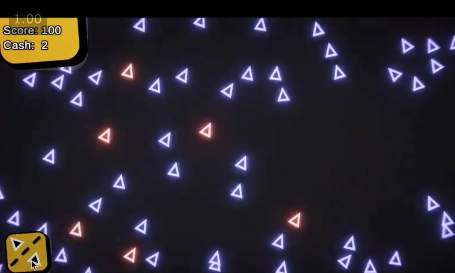
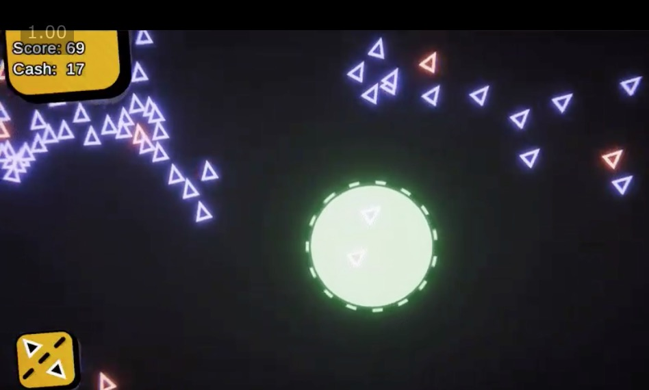

# Boids - OutOfControl
This project has been realised for the GMTK Game Jam 2020.

# Rules
Complete a game in less than 48h adhering to the theme - out of control.

# Game Idea
This game is a boids simulation. During gameplay you receive cash that you can spend to distance the entities to avoid spreading an infection. 
Alternatively you can spend money to isolate some entities for a certain amount of time until they heal.

# Final
I started later and worked partially on this project, so this was made in less than 24h probably.
THe above mentioned features are working, but the game is not yet calibrated in terms of timing and progression. 
Due to the time constraints I didn't manage to make the game feel satisfying.

# My main goal
I wanted to understand and fiddle around with boids simulation. For this reason I'm happy that I accepted this challenge.
